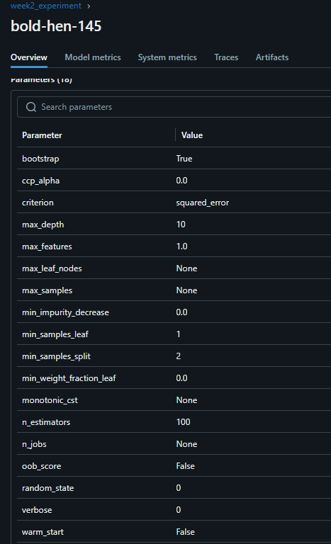
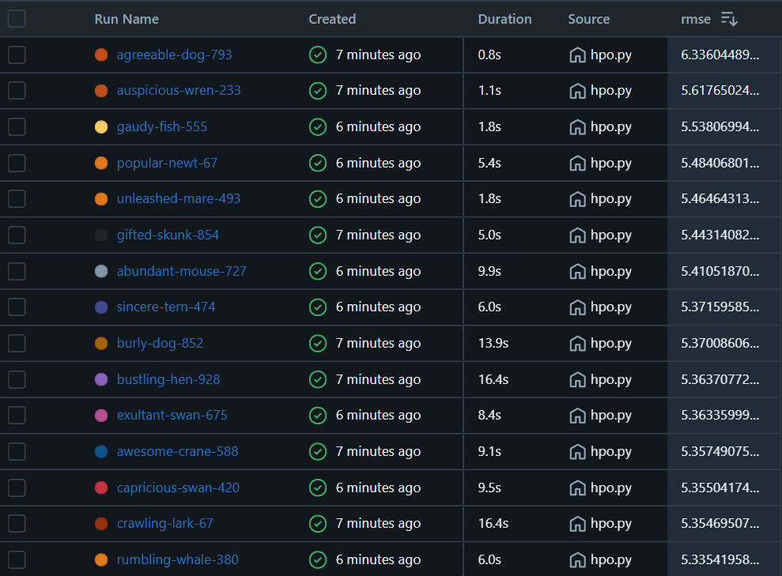
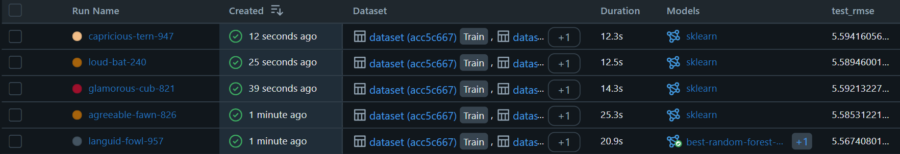
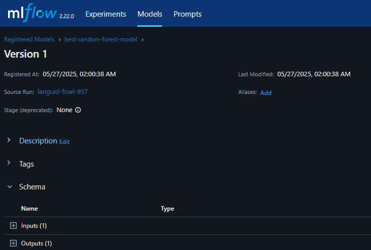

This readme gives information on the flow of commands to run for all questions in the [homework](https://github.com/DataTalksClub/mlops-zoomcamp/blob/main/cohorts/2025/02-experiment-tracking/homework.md)
# Q1. MLflow Installation
```bash
pip install mlflow```

```bash 
PS C:\Users\shrus\Desktop\MLOpsZoomcamp2025\week2> mlflow --version
mlflow, version 2.22.0
```
# Q2. Download and preprocess data
Ensure the green taxi dataset is being used
```bash
PS C:\Users\shrus\Desktop\MLOpsZoomcamp2025\week2> ls data

Mode                 LastWriteTime         Length Name
----                 -------------         ------ ----
-a----         5/26/2025   8:49 PM        1427002 green_tripdata_2023-01.parquet
-a----         5/26/2025   8:49 PM        1533740 green_tripdata_2023-02.parquet
-a----         5/26/2025   8:50 PM        1730999 green_tripdata_2023-03.parquet
```
Perform the preprocessing via
```bash
PS C:\Users\shrus\Desktop\MLOpsZoomcamp2025\week2> python preprocess_data.py --raw_data_path ./data --dest_path ./output
```
See the output .pkl files
```bash
PS C:\Users\shrus\Desktop\MLOpsZoomcamp2025\week2> ls output

Mode                 LastWriteTime         Length Name
----                 -------------         ------ ----
-a----         5/27/2025  12:45 AM         131004 dv.pkl
-a----         5/27/2025  12:45 AM        2458697 test.pkl
-a----         5/27/2025  12:45 AM        2374517 train.pkl
-a----         5/27/2025  12:45 AM        2215823 val.pkl
```

# Q3. MLflow autologging
```bash
python train.py
```
See results on the mlflow ui
```bash
mlflow ui
```


# Q4. MLflow Tracking Server
Run this for the remainder of the exercise
```bash
mlflow server --backend-store-uri sqlite:///mlflow.db --default-artifact-root ./artifacts --host 127.0.0.1 --port 5000
```
# Q5. Tune model hyperparameters
```bash
python hpo.py
```


# Q6. Promote the best model to the model registry
```bash
python register_model.py
```

